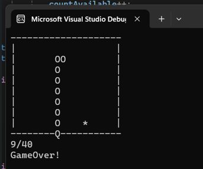
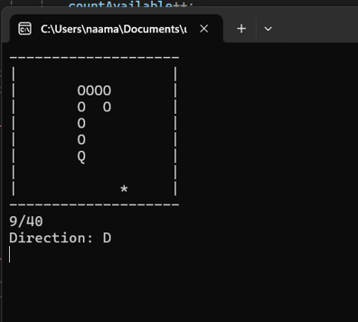
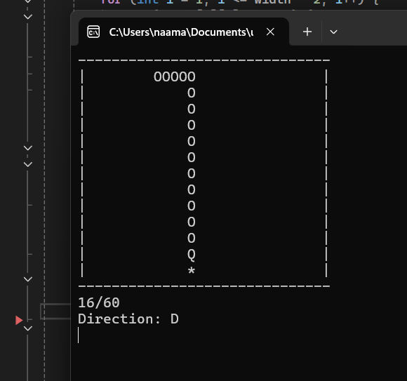

#  Snake Game in C 🐍

This is a classic Snake game implemented in C.  
The snake is represented using a **linked list**, allowing smooth movement and growth mechanics.

## 🎮 Game Instructions

- **Don't hit the walls** – stay inside the play area.
- **Don't run into yourself** – avoid your own tail.
- **Eat the stars (`*`)** to grow and increase your score.
- **Use the arrow keys on your keyboard** to control the snake's direction.
- The game gets harder as you progress!

## 📸 Screenshots

- 
- 
- 

## 🛠️ How to Compile

Make sure you have a C compiler like `gcc` installed.  
To compile the game, run:

```bash
gcc snake.c -o snake
```

## ▶️ How to Run

After compiling, run the game with:

```bash
./snake
```

Enjoy! 
